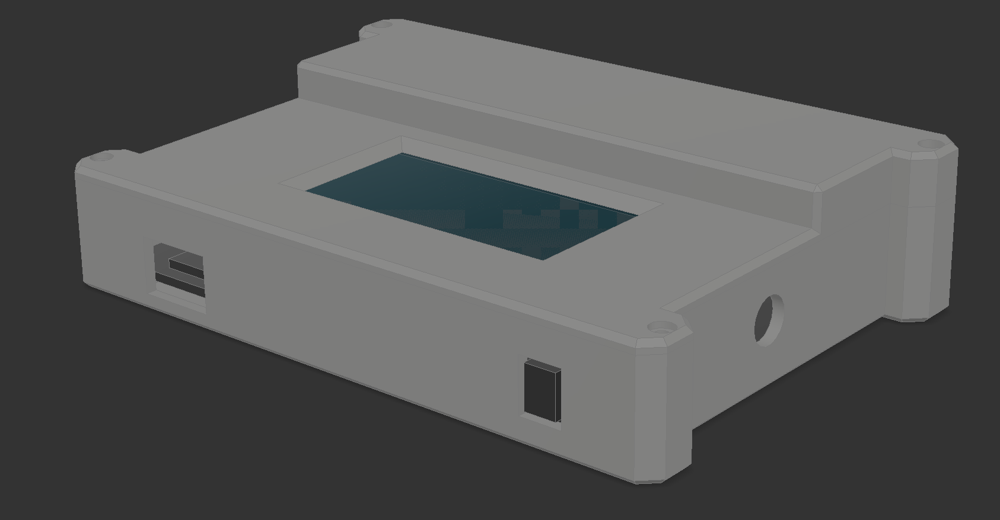

# GNSS Sensor Tracker

The GNSS Sensor Tracker is an open-source, sensor-rich, GNSS/GPS tracking board intended to provide a base design accelerator for custom Meadow-based GNSS tracking solutions.

## Design

This board was designed while streaming live, you can watch the videos [here](https://www.youtube.com/watch?v=L4MavM8ilkg&list=PLoP9Fu9zn7qY4rkFJjHBhnpI8mPlw8RfS).

### Hardware

The hardware design can be found in the [Source/Hardware](Source/Hardware) folder.

Design documentation can be found in [Docs](Docs).

### [Industrial Design](Source/Industrial_Design)

The enclosure was designed in Autodesk Fusion 360 the source file can be found [here](Source/Industrial_Design/GNSS_Tracker_Enclosure.f3d).

STL files for printing can be found in the [Industrial Design folder](Source/Industrial_Design).