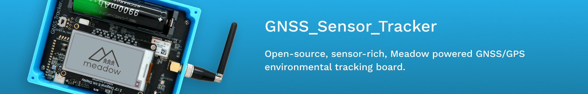

# GNSS_Sensor_Tracker

The GNSS Sensor Tracker is an open-source, sensor-rich, GNSS/GPS tracking board intended to provide a base design accelerator for custom Meadow-based GNSS tracking solutions.

## Contents
* [Purchasing or Building](#purchasing-or-building)
* [Getting Started](#getting-started)
* [Hardware Specifications](#hardware-specifications)
* [Pinout Diagram](#pinout-diagram)
  * [Project Lab v1.e](#project-lab-v1e)
  * [Project Lab v2.e](#project-lab-v2e)
* [Additional Samples](#additional-samples)

## Purchasing or Building

<table width="100%">
    <tr>
        <td>
            
        </td>
        <td>
             
        </td>
    </tr>
    <tr>
        <td>
            You can get a Gnss Sensor Tracker fully assembled from the <a href="https://store.wildernesslabs.co/collections/frontpage/products/project-lab-board">Wilderness Labs store</a>.
        </td>
        <td> 
            It's also designed so that it can be assembled at home for the adventurous. All design files can be found in the <a href="Source/Hardware">Hardware Design</a> folder.
        </td>
    </tr>
</table>

## Getting Started

To simplify the way to use this Meadow-powered reference IoT product, we've created a NuGet package that instantiates and encapsulates the onboard hardware into a `GnssTracker` class.

1. Add the ProjectLab Nuget package your project: 
    - `dotnet add package Meadow.GnssTracker`, or
    - [Meadow.GnssTracker Nuget Package](https://www.nuget.org/packages/Meadow.GnssTracker)
    - [Explore in Fuget.org](https://www.fuget.org/packages/Meadow.ProjectLab/0.1.0/lib/netstandard2.1/ProjectLab.dll/Meadow.Devices/ProjectLab)

2. Instantiate the `ProjectLab` class:  
```csharp
public class MeadowApp : App<F7FeatherV2>
{
    IProjectLabHardware projLab;

    public override Task Initialize()
    {
        projLab = ProjectLab.Create();
        ...
```

3. To Access the `Project Lab` onboard peripherals:
```csharp
    if (projLab.EnvironmentalSensor is { } bme688)
    {
        bme688.Updated += Bme688Updated;
        bme688.StartUpdating(TimeSpan.FromSeconds(5));
    }
```

4. To use an I2C peripheral (with a [Grove Character display](https://wiki.seeedstudio.com/Grove-16x2_LCD_Series) as an example):
```csharp
    var display = new CharacterDisplay
    (
        i2cBus: projLab.I2cBus,
        address: (byte)I2cCharacterDisplay.Addresses.Grove,
        rows: 2, columns: 16,
        isGroveDisplay: true
    );
```


## Design

This board was designed while streaming live, you can watch the videos [here](https://www.youtube.com/watch?v=L4MavM8ilkg&list=PLoP9Fu9zn7qY4rkFJjHBhnpI8mPlw8RfS).

### Hardware

The hardware design can be found in the [Source/Hardware](Source/Hardware) folder.

Design documentation can be found in [Docs](Docs).

### [Industrial Design](Source/Industrial_Design)


The enclosure was designed in Autodesk Fusion 360 the source file can be found [here](Source/Industrial_Design/GNSS_Tracker_Enclosure.f3d).

STL files for printing can be found in the [Industrial Design folder](Source/Industrial_Design).